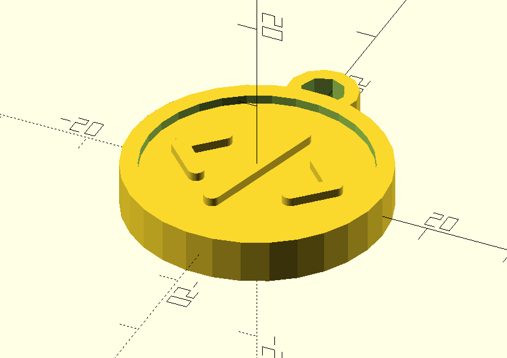
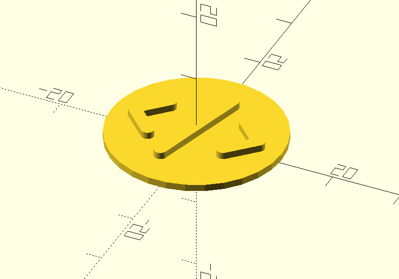
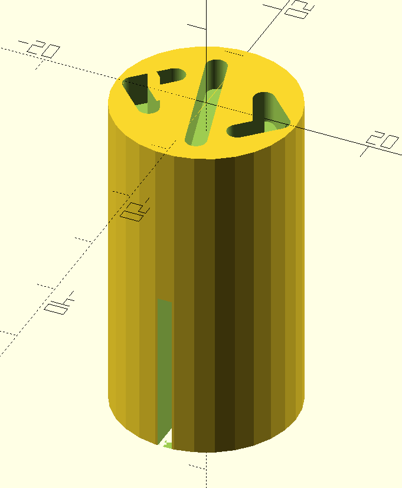

# Model of a circular Keychain NFC Tag

The models included in this repository were built for making some simple NFC keychains with a custom logo that
are easy to reproduce or modify as needed.

If you plan to print these keychains, you will also need to source NFC stickers. The ones used for this project were
thin stickers measuring 25mm in diameter.

## Setup

The included models were built with [OpenSCAD](https://openscad.org/).

The SCAD files are all well commented to descript each step. For further help, see the OpenSCAD documentation, or this
[cheat sheet](https://openscad.org/cheatsheet/) as a reference.

If you add an NFC sticket to the tags, you can use _NFC Tools_ on
[Android](https://play.google.com/store/apps/details?id=com.wakdev.wdnfc&gl=US) or on
[iOS](https://apps.apple.com/us/app/nfc-tools/id1252962749) to write which URL (or other data) the tag should respond with.

## Models Included

There are some re-usable components in the `./components` directory. The `*.scad` files in the root of this repository
are each representing one of the following main models meant for 3D printing.

### NFC Keychain Tag Body (`./keychain-body.scad`)

### Inner Face for Keychain Body (`./inner-face.scad`)

### Orientation Tool (`./orientation-tool.scad`)

